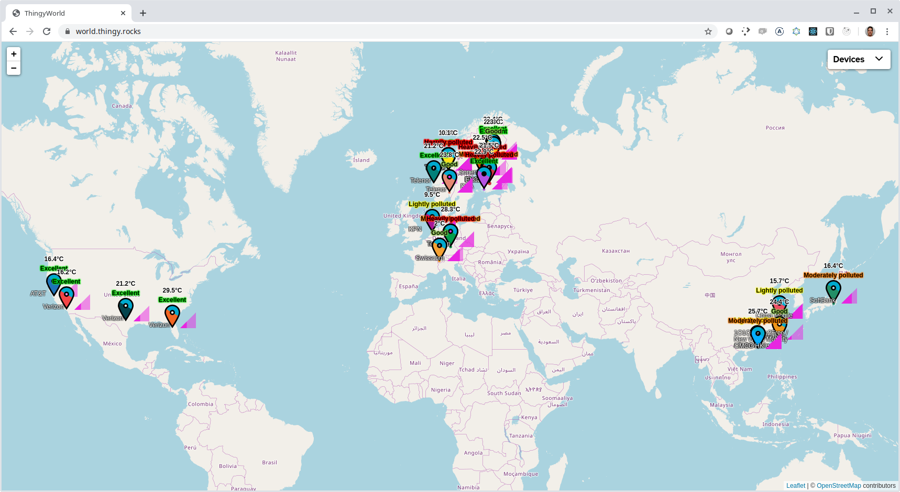
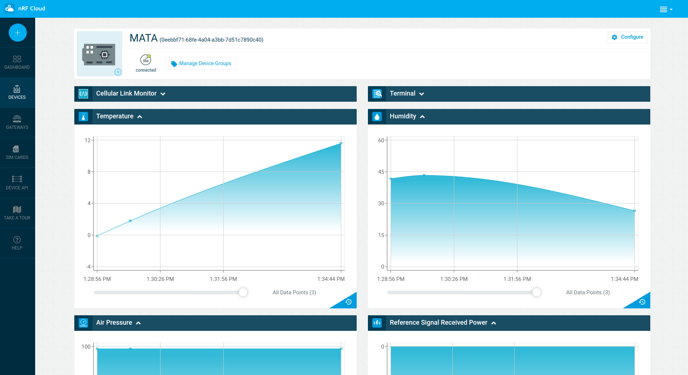
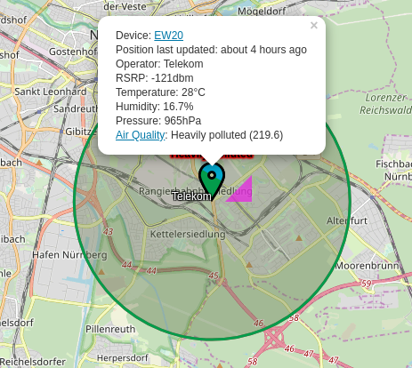

# How we build ThingyWorld for Embedded World 2020

When we wanted to show off our favorite development kit, the
[Thingy:91](https://www.nordicsemi.com/Software-and-tools/Prototyping-platforms/Nordic-Thingy-91),
at last year's embedded world in Nuremberg, we discovered that because of the
high volume of devices at the tradeshow, the TCP packets our Thingys were
sending on the NB-IoT network were dropped. To be fair NB-IoT are not designed
to be used for TCP and this can be considered a compatibility hack to simplify
development with devices that need TCP and TLS end-to-end secure connections.
For production deployments UDP should be used in NB-IoT networks.

To have a better experience in 2020 we needed to used UDP to be able to send
real-time updates from the trade show floor&mdash;at least with a _high_
probability of them reaching the cloud where the data is consolidated and
visualized. But because [nRF Connect for Cloud](https://nrfcloud.com/), which is
based on [AWS IoT Core](https://aws.amazon.com/iot-core/), only supports TCP+TLS
we needed an alternative way to connect the devices.

We decided to modify the existing `asset_tracker` example from our
[nRF Connect SDK](https://www.nordicsemi.com/Software-and-tools/Software/nRF-Connect-SDK)
so it sends the messages intended for nRF Connect for Cloud MQTT broker to an
_UDP proxy_ instead. To simplify the communication we decided to not
authenticate the devices any more and only use the IMEI of a device as an
identifier. This removed the need for the rather complicated process of flashing
certificates to devices and associating them with an nRF Connect for Cloud
account; this is the task of the proxy server.

The proxy server (written in Node.js and running on an AWS EC2 t2.micro
instance) listens for incoming messages in the format
`<device id>:<JSON payload>` and registers an nRF Connect for Cloud device _on
demand_ for devices that haven sent messages in before. This has serious
security implications, but for a demo use-case this turned out to be a great
solution.

We sent out one firmware hexfile to our field application engineers and within
hours we had thingies connecting literally from all over the world, because all
they needed to do was to flash the hexfile, and turn on the Thingy:91. The proxy
was then taking care of the rest.

The incoming data is forwarded to nRF Connect for Cloud where it arrives as if
the device had sent the message directly:

In addition it is sent directly to the WorldMap that the proxy is hosting, using
a websocket connection so real-time updates appear on the map. This enabled us
for the the first time to visualize signal strength properly and to highlight
the air quality feature of Bosch's
[BME680](https://blog.nordicsemi.com/getconnected/bosch-sensortec-bme680-the-nose-of-nordics-thingy91)
which calculates an Air Quality Index based on multiple environmental sensor
readings.

We also prepared for the fact that the Thingys on the trade show floor won't be
able to acquire GPS fixes because they would be indoors, so we let the proxy
resolve their cell locations using [locationapi.org](http://locationapi.org/).
Devices show up on the map with a circle to indicate that their location is
approximated using their cell information:

This demo also helped us to showcase the variety of network operators that
already support NB-IoT all over the world.

## Source code

We won't release the demo into our SDK because it is not an example that should
be widely adopted, it works well for a demo like this with a limited lifetime
but is not secure and the protocol still has a lot of overhead.

Nevertheless you can download the source code for the `asset_tracker`
application with the UDP backend
[from here](https://github.com/coderbyheart/nrfcloud-udp-proxy/files/4261689/fw-nrfconnect-nrf-Thingy91WorldFW_v0.2.0.zip),
and you can checkout the fork of `fw-nrfconnect-nrf` with the modifications
[here](https://github.com/joakimtoe/fw-nrfconnect-nrf/tree/Thingy91WorldFW_v0.2.0).

The proxy server source code can be found
[here](https://github.com/coderbyheart/nrfcloud-udp-proxy).
